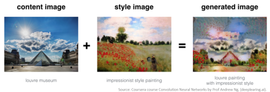

# Art Generation using Deep Style transfer Algorithm
## Neural Style Transfer
Neural Style Transfer (NST) is one of the most fun techniques in deep learning. As seen below, it merges two images, namely, a "content" image (C) and a "style" image (S), to create a "generated" image (G). The generated image G combines the "content" of the image C with the "style" of image S. This is the example of an image of the Louvre museum in Paris (content image C), mixed with a painting by Claude Monet, a leader of the impressionist movement (style image S).

## Transfer Learning
Neural Style Transfer (NST) uses a previously trained convolutional network, and builds on top of that. The idea of using a network trained on a different task and applying it to a new task is called transfer learning.

Following the original NST paper (https://arxiv.org/abs/1508.06576), I used the VGG network. Specifically, I used VGG-19, a 19-layer version of the VGG network. This model has already been trained on the very large ImageNet database, and thus has learned to recognize a variety of low level features (at the earlier layers) and high level features (at the deeper layers).

The model is stored in a python dictionary where each variable name is the key and the corresponding value is a tensor containing that variable's value. To run an image through this network, you just have to feed the image to the model. In TensorFlow, you can do so using the tf.assign function.

This assigns the image as an input to the model. After this, if you want to access the activations of a particular layer, say layer ` 4_2 ` when the network is run on this image, you would run a TensorFlow session on the correct tensor ` conv4_2 `

## Building the NST Algorithm
NST algorithm can be built in three steps:

- Build the content cost function  Jcontent(C,G) 
- Build the style cost function  Jstyle(S,G) 
- Put it together to get  J(G)=αJcontent(C,G)+βJstyle(S,G).

### Computing the content cost
The content image C will be the picture of the Louvre Museum in Paris. The content image (C) shows the Louvre museum's pyramid surrounded by old Paris buildings, against a sunny sky with a few clouds.

As the earlier (shallower) layers of a ConvNet tend to detect lower-level features such as edges and simple textures, and the later (deeper) layers tend to detect higher-level features such as more complex textures as well as object classes.

We would like the "generated" image G to have similar content as the input image C. Suppose we have chosen some layer's activations to represent the content of an image. In practice, we'll get the most visually pleasing results if we choose a layer in the middle of the network--neither too shallow nor too deep.

So, suppose we have picked one particular hidden layer to use. Now, set the image C as the input to the pretrained VGG network, and run forward propagation. Let  a(C)  be the hidden layer activations in the layer we had chosen. This will be a  nH×nW×nC  tensor. Repeat this process with the image G: Set G as the input, and run forward progation. Let a(G) be the corresponding hidden layer activation. We will define as the content cost function as:

                           Jcontent(C,G)=1/4×nH×nW×nC{∑all entries(a(C)−a(G))^2}

Here,  nH,nW  and  nC  are the height, width and number of channels of the hidden layer you have chosen, and appear in a normalization term in the cost. For clarity, note that  a(C)  and  a(G)  are the volumes corresponding to a hidden layer's activations. In order to compute the cost  Jcontent(C,G) , it might also be convenient to unroll these 3D volumes into a 2D matrix, as shown below. 

### Computing the style cost
### style matrix 
The style matrix is also called a "Gram matrix." In linear algebra, the Gram matrix G of a set of vectors  (v1,…,vn)  is the matrix of dot products, whose entries are  Gij=vTivj=np.dot(vi,vj) . In other words,  Gij  compares how similar  vi  is to  vj : If they are highly similar, you would expect them to have a large dot product, and thus for  Gij  to be large.

Note that there is an unfortunate collision in the variable names used here. We are following common terminology used in the literature, but  G  is used to denote the Style matrix (or Gram matrix) as well as to denote the generated image  G. In NST, you can compute the Style matrix by multiplying the "unrolled" filter matrix with their transpose.

The result is a matrix of dimension  (nC,nC)  where  nC  is the number of filters. The value  Gij  measures how similar the activations of filter  i  are to the activations of filter  j .

One important part of the gram matrix is that the diagonal elements such as  Gii  also measures how active filter  i  is. For example, suppose filter  i  is detecting vertical textures in the image. Then  Gii  measures how common vertical textures are in the image as a whole: If  Gii  is large, this means that the image has a lot of vertical texture.

By capturing the prevalence of different types of features ( Gii ), as well as how much different features occur together ( Gij ), the Style matrix  G  measures the style of an image.
### style cost

After generating the Style matrix (Gram matrix), your goal will be to minimize the distance between the Gram matrix of the "style" image S and that of the "generated" image G. For now, we are using only a single hidden layer  a[l] , and the corresponding style cost for this layer is defined as:

                                  Jstyle(S,G)=1/4×nC2×(nH×nW)^2{∑i=1 to n{∑j=1nC(G(S)ij−G(G)ij)^2}

where  G(S)  and  G(G)  are respectively the Gram matrices of the "style" image and the "generated" image, computed using the hidden layer activations for a particular hidden layer in the network.

## Solving the optimization problem
Finally, let's put everything together to implement Neural Style Transfer!

Here's what the program will have to do:

- Create an Interactive Session
- Load the content image
- Load the style image
- Randomly initialize the image to be generated
- Load the VGG16 model
- Build the TensorFlow graph:
     1. Run the content image through the VGG16 model and compute the content cost
     2. Run the style image through the VGG16 model and compute the style cost
     3. Compute the total cost
     4. Define the optimizer and the learning rate
- Initialize the TensorFlow graph and run it for a large number of iterations, updating the generated image at every step.
